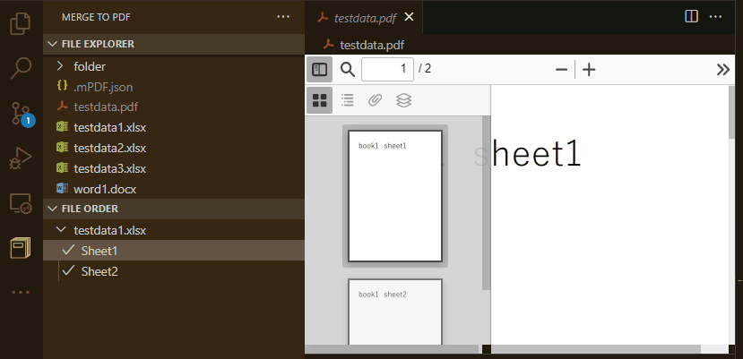

# mPDF

Create PDF from some MS-Office(.docx, .xlsx) documents.

## Features

Combine selected documents into PDF.

**Displaying PDF is a feature of another extension.**

## Requirements

- Windows OS and MS-Office local installasion.
- PDF Viewer for vscode. 

## Release Notes

### 0.0.2

Add icon and images.
