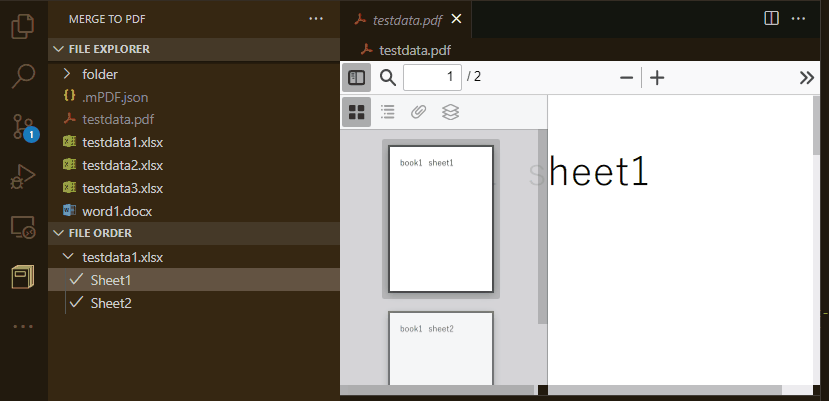

# mPDF

Create PDF from some MS-Office(.docx, .xlsx) documents.

## Features

Combine selected documents into PDF.

The merged PDF is shown in the built-in **mPDF Preview** panel (powered by [PDF.js](https://mozilla.github.io/pdf.js/)).

## Requirements

- Windows OS and MS-Office local installation.

## Release Notes

### 0.2.0

winax（ネイティブモジュール）をやめ、PowerShell を非表示の子プロセスとして実行して変換する。VS Code 更新時の再ビルドが不要になった。
結合した PDF を拡張内蔵のプレビュー（PDF.js）で表示し、他の PDF 拡張が不要に。
変換・結合のエラーを通知するようにし、VS Code 再起動後にドラッグで並び替えできない不具合などを修正。VS Code 1.90 以降が必要。

### 0.1.0

powershell ではなく winax を使用する。

### 0.0.4

ファイル名に中黒（・）が使用できなかった事象に対応。

### 0.0.3

Excel から PDF を作成するタイミングの修正

### 0.0.2

Add icon and images.
